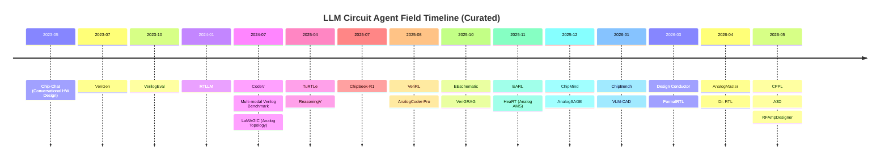

```mermaid
timeline
    title LLM Circuit Agent Full Timeline (All Curated Entries)
    2023-05 : Chip-Chat
    2023-07 : VeriGen
             : Verilog_GitHub Dataset
    2023-10 : VerilogEval
    2023-12 : Improving Large Language Model Hardware Generating Quality through
    2024-01 : RTLLM
    2024-03 : Data is all you need
             : Learning-driven Physically-aware Large-scale Circuit Gate Sizing
    2024-04 : RTL-Repair
             : DE-HNN
    2024-06 : LLM-Enhanced Bayesian Optimization for Efficient Analog Layout Constraint
    2024-07 : CodeV
             : Large Language Model for Verilog Generation with Code-Structure-Guided
             : LaMAGIC
             : RoSE-Opt
             : AICircuit
             : Natural language is not enough
             : PyraNet-Verilog Dataset
    2024-11 : Schemato -- An LLM for Netlist-to-Schematic Conversion
    2024-12 : DocEDA
    2025-01 : MetRex
    2025-02 : CIRCUIT
             : Towards Understanding Fine-Tuning Mechanisms of LLMs via Circuit
    2025-03 : RTL-LLM
             : Improving LLM-Based Verilog Code Generation with Data Augmentation
             : LIMCA
             : VHDL GitHub Deduplicated
             : Chisel-Verilog Pairs
    2025-04 : SymRTLO
             : VFlow
             : ReasoningV
             : Towards Optimal Circuit Generation
             : TuRTLe
             : ReasoningV-5K Dataset
    2025-05 : VeriSynth
             : RTL++
             : Abstractions-of-Thought
             : FALCON
             : PyMTL-Verilog Pairs
    2025-06 : BugGen
             : ORFS-agent
             : AutoCircuit-RL
             : CIRCUITSYNTH-RL
             : SpiceMixer
             : A Large Language Model-based Multi-Agent Framework for Analog
    2025-07 : ChipSeek-R1
             : DiffCkt
             : AnalogTester
    2025-08 : VERIRL
             : ASIC-Agent
             : CRADLE
             : White-Box Reasoning
             : AnalogCoder-Pro
    2025-09 : LocalV
             : SPARC-RTL
             : RTLSeek
             : VeriReason
             : EEsizer
             : TopoSizing
             : Pluto
             : Refining Specs For LLM-Based RTL Agile Design
    2025-10 : VeriGRAG
             : DeepV
             : LLM-VeriPPA
             : REvolution
             : EEschematic
    2025-11 : PrefixGPT
             : QiMeng-CRUX
             : R3A
             : TB or Not TB
             : Automating Hardware Design and Verification from Architectural Papers
             : Think with Self-Decoupling and Self-Verification
             : CorrectHDL
             : EARL
             : HeaRT
             : AnaFlow
    2025-12 : AutoFSM
             : When Forgetting Builds Reliability
             : Mitigating Hallucinations and Omissions in LLMs for Invertible
             : Duet
             : Architect in the Loop Agentic Hardware Design and
             : David vs. Goliath
             : ChipMind
             : AnalogSAGE
             : NotSoTiny
             : Large Language Model for Verilog Code Generation
    2026-01 : GRPO with State Mutations
             : Automated QoR improvement in OpenROAD with coding agents
             : Veri-Sure
             : VLM-CAD
             : ChipBench
             : Bench4HLS
             : A New Benchmark for the Appropriate Evaluation of
    2026-02 : MING
             : ACE-RTL
             : FormalRTL
             : TriGen
             : SiliconMind-V1
             : ArchAgent
             : CktEvo
             : VeriInteresting
    2026-03 : Agent Factories for High Level Synthesis
             : IncreRTL
             : UCAgent
             : QiMeng-CodeV-SVA
             : AutoVeriFix+
             : SpecLoop
             : POET
             : CODMAS
             : Retrieve, Schedule, Reflect
             : LUMINA
             : Design Conductor
             : FluxEDA
             : Exploring the Agentic Frontier of Verilog Code Generation
             : Wrong Code, Right Structure
             : Causal AI For AMS Circuit Design
             : HWE-Bench
             : Synthesis-in-the-Loop Evaluation of LLMs for RTL Generation · Quality,
             : VERIBENCH
             : Energy Efficient Software Hardware CoDesign for Machine Learning ·
             : SCALE-Sim TPU
             : AI+HW 2035
             : ChatNeuroSim
             : BrainWave NPU Microarchitecture Analysis
             : EEschematic Presentation
             : ASIC Technology Lecture
             : Digital System Design PDF
             : Springer Book
    2026-04 : SafeTune
             : Exploring LLM-based Verilog Code Generation with Data-Efficient Fine-Tuning
             : HAVEN
             : From Language to Logic
             : ChatSVA
             : Automated SVA Generation with LLMs
             : From Indiscriminate to Targeted
             : How Can Reinforcement Learning Achieve Expert-level Placement?
             : RAG-Enhanced Kernel-Based Heuristic Synthesis (RKHS) · A Structured Methodology
             : TimingLLM
             : Autonomous Evolution of EDA Tools
             : Dr. RTL
             : Agentic Architect
             : VeriGraphi
             : Self-Calibrating LLM-Based Analog Circuit Sizing with Interpretable Design
             : AnalogMaster
             : RuC
    2026-05 : CPPL
             : UVmarvel
             : PipeRTL
             : A3D
             : Design Conductor 2.0
             : CircuitFormer
             : RFAmpDesigner
             : AssertLLM2
             : Bridging the Last Mile of Circuit Design
             : AMSnet-q
    2026-06 : LLM4RTL
             : EstRTL
             : Programming Domain-Specific FPGA Hardblocks from HLS · An RTL
             : CASS-RTL
             : VeriPilot
             : Shift-Left High-Level Synthesis Verification via Knowledge-Augmented LLM Agent
             : AUTOGATE
             : LongRTL
             : RTLScout
             : StepPRM-RTL
             : HORIZON
             : CHIA
             : PANDA
             : MultModLM
             : PDAgent-Bench
             : VHDLSuite
             : Croc
    2026-07 : VeriRefine
             : MechMem-RTL
             : Rtl2lean
             : Can AI Agents Really Complete RTL-to-GDS? Lessons from
             : Towards Reliable AI-Assisted Analog Design
             : SABLE
             : WaveformQA
             : ChipVerilog
             : LLM for EDA in Front-End Design
```

# Awesome LLM Circuit Agent


[](https://awesome.re) 
[](https://opensource.org/licenses/MIT)
[](http://makeapullrequest.com)

A curated list of papers, datasets, and resources related to **Large Language Models (LLMs) for Circuit Design**, covering both Digital (RTL) and Analog domains. This repository aims to track the rapid advancements in using AI agents for hardware design automation.

## 📖 Table of Contents

- [Landscape Map](#-landscape-map)
- [Digital Circuit Design (RTL)](#-digital-circuit-design-rtl)
  - [Code Generation & Synthesis](#-code-generation--synthesis)
  - [Verification & Testing](#-verification--testing)
  - [Optimization (PPA-aware)](#-optimization-ppa-aware)
  - [Reinforcement Learning Approaches](#-reinforcement-learning-approaches)
  - [Multi-Agent Systems & Workflows](#-multi-agent-systems--workflows)
  - [Reasoning & Graph-Based](#-reasoning--graph-based)
- [Analog Circuit Design](#-analog-circuit-design)
  - [Topology & Schematic Generation](#-topology--schematic-generation)
  - [Sizing & Optimization](#-sizing--optimization)
  - [Workflows & Multi-Agent](#-workflows--multi-agent)
  - [Specialized Applications](#-specialized-applications)
- [Analog Mind Series (Behzad Razavi)](#-analog-mind-series-behzad-razavi)
- [Datasets & Benchmarks](#-datasets--benchmarks)
- [Resources & Learning](#-resources--learning)
- [Contributing](#-contributing)

---

## 🗺️ Landscape Map

GitHub **natively renders Mermaid** in README files. The landscape is maintained in [`llm_circuit_agent_landscape/`](llm_circuit_agent_landscape/): **edit YAML → generate Mermaid → sync to README**.

```bash
cd llm_circuit_agent_landscape && make all   # validate + render + sync README
```

### Curated Timeline

<!-- LANDSCAPE-TIMELINE-REPORT:BEGIN -->



<!-- LANDSCAPE-TIMELINE-REPORT:END -->

<details>
<summary><b>Full timeline (all curated entries)</b></summary>

<!-- LANDSCAPE-TIMELINE-FULL:BEGIN -->



<!-- LANDSCAPE-TIMELINE-FULL:END -->

</details>

<details>
<summary><b>Category map</b></summary>

<!-- LANDSCAPE-CATEGORY-MAP:BEGIN -->

```mermaid
flowchart TB
    subgraph digital_codegen["Digital · RTL Code Generation"]
        direction TB
        chip_chat["Chip-Chat<br/><i>Conversational LLM, Tapeout</i>"]
        verigen["VeriGen<br/><i>Finetuning</i>"]
        codev["CodeV<br/><i>Summarization</i>"]
        data_is_all_you_need["Data is all you need<br/><i>Finetuning</i>"]
        autofsm["AutoFSM<br/><i>FSM, Multi-Agent, IR</i>"]
        deepv["DeepV<br/><i>RAG</i>"]
        localv["LocalV<br/><i>Verilog, IP-level</i>"]
        mitigating_hallucinations_and_omissions["Mitigating Hallucinations and Omissions in LLMs for Invertible<br/><i>Hallucination Mitigation, LCT, Autoencoder</i>"]
        prefixgpt["PrefixGPT<br/><i>Prefix Adder, Transformer</i>"]
        qimeng_crux["QiMeng-CRUX<br/><i>NL2Verilog, CRUX</i>"]
        rtl_llm["RTL-LLM<br/><i>Multi-Language</i>"]
        sparc_rtl["SPARC-RTL<br/><i>Prompt Engineering</i>"]
        verigrag["VeriGRAG<br/><i>Structure-Aware</i>"]
        when_forgetting_builds_reliability["When Forgetting Builds Reliability<br/><i>LLM Unlearning, Hardware Code Generation</i>"]
        ace_rtl["ACE-RTL<br/><i>Agentic Context Evolution</i>"]
        agent_factories_for_high_level_synthesis["Agent Factories for High Level Synthesis<br/><i>HLS, Coding Agents, Multi-Agent</i>"]
        cass_rtl["CASS-RTL<br/><i>RTL Generation, Inference-time Steering</i>"]
        cppl["CPPL<br/><i>RTL Generation, Compiler-Mediated, CIRCT</i>"]
        estrtl["EstRTL<br/><i>RTL Generation, Functional Estimation</i>"]
        exploring_llm_based_verilog_code_generat["Exploring LLM-based Verilog Code Generation with Data-Efficient Fine-Tuning<br/><i>Verilog Generation</i>"]
        incrertl["IncreRTL<br/><i>Incremental RTL, Requirement Evolution</i>"]
        llm4rtl["LLM4RTL<br/><i>RTL Generation, Tool-Augmented LLM</i>"]
        ming["MING<br/><i>HLS, MLIR, CNN</i>"]
        programming_domain_specific_fpga_hardblo["Programming Domain-Specific FPGA Hardblocks from HLS · An RTL<br/><i>HLS, FPGA Hardblocks, RTL Blackbox</i>"]
        safetune["SafeTune<br/><i>RTL Code Generation, Fine-Tuning Security</i>"]
        verirefine["VeriRefine<br/><i>RTL Generation, Spec Refinement, ASTF</i>"]
    end
    subgraph digital_verification["Digital · Verification & Testing"]
        direction TB
        rtl_repair["RTL-Repair<br/><i>RTL Repair, Symbolic</i>"]
        automating_hardware_design_and_verificat["Automating Hardware Design and Verification from Architectural Papers<br/><i>Neural-Symbolic</i>"]
        buggen["BugGen<br/><i>Bug Synthesis, Multi-Agent</i>"]
        correcthdl["CorrectHDL<br/><i>HLS, RAG</i>"]
        duet["Duet<br/><i>Design Understanding, Experimentation</i>"]
        r3a["R3A<br/><i>RTL Repair, Multi-Agent</i>"]
        tb_or_not_tb["TB or Not TB<br/><i>Stimulus Gen, DPO</i>"]
        think_with_self_decoupling_and_self_veri["Think with Self-Decoupling and Self-Verification<br/><i>Self-Verification</i>"]
        verisynth["VeriSynth<br/><i>Formal Verification</i>"]
        autoverifix["AutoVeriFix+<br/><i>RTL Fixing, Concolic Testing</i>"]
        automated_sva_generation_with_llms["Automated SVA Generation with LLMs<br/><i>SVA Generation, Hardware Verification</i>"]
        chatsva["ChatSVA<br/><i>SVA Generation, Hardware Verification</i>"]
        formalrtl["FormalRTL<br/><i>Verified RTL Synthesis, Formal Equivalence</i>"]
        from_indiscriminate_to_targeted["From Indiscriminate to Targeted<br/><i>RTL Verification, Assertion Generation</i>"]
        from_language_to_logic["From Language to Logic<br/><i>SVA Generation, Formal Verification</i>"]
        grpo_with_state_mutations["GRPO with State Mutations<br/><i>Test Plan Generation, GRPO, RL</i>"]
        haven["HAVEN<br/><i>UVM Testbench Generation</i>"]
        mechmem_rtl["MechMem-RTL<br/><i>RTL Repair, Mechanism Memory</i>"]
        qimeng_codev_sva["QiMeng-CodeV-SVA<br/><i>Assertion Generation, NL2SVA</i>"]
        rtl2lean["Rtl2lean<br/><i>Formal Verification, RTL-to-Lean</i>"]
        shift_left_high_level_synthesis_verifica["Shift-Left High-Level Synthesis Verification via Knowledge-Augmented LLM Agent<br/><i>HLS Verification, Shift-Left</i>"]
        specloop["SpecLoop<br/><i>RTL-to-Specification, Formal Verification</i>"]
        ucagent["UCAgent<br/><i>Functional Verification, Block-Level</i>"]
        uvmarvel["UVmarvel<br/><i>UVM Verification, Subsystem-level RTL</i>"]
        veripilot["VeriPilot<br/><i>RTL Debugging, Golden Model, CDFG</i>"]
    end
    subgraph digital_optimization["Digital · PPA Optimization"]
        direction TB
        improving_large_language_model_hardware["Improving Large Language Model Hardware Generating Quality through<br/><i>Post-LLM Search</i>"]
        chipseek_r1["ChipSeek-R1<br/><i>RL, PPA</i>"]
        llm_verippa["LLM-VeriPPA<br/><i>PPA Optimization</i>"]
        orfs_agent["ORFS-agent<br/><i>Physical Design</i>"]
        symrtlo["SymRTLO<br/><i>Symbolic Reasoning</i>"]
        autogate["AUTOGATE<br/><i>RTL Optimization, Clock Gating, Power</i>"]
        automated_qor_improvement_in_openroad_wi["Automated QoR improvement in OpenROAD with coding agents<br/><i>OpenROAD, Coding Agents, PPA</i>"]
        autonomous_evolution_of_eda_tools["Autonomous Evolution of EDA Tools<br/><i>EDA Tools, Multi-Agent, Self-Evolution</i>"]
        codmas["CODMAS<br/><i>RTL Optimization, Multi-Agent, PPA</i>"]
        dr_rtl["Dr. RTL<br/><i>RTL Optimization, Agentic Workflow</i>"]
        how_can_reinforcement_learning_achieve_e["How Can Reinforcement Learning Achieve Expert-level Placement?<br/><i>Chip Placement, Reinforcement Learning</i>"]
        lumina["LUMINA<br/><i>GPU DSE, Bottleneck Analysis, LLM-guided</i>"]
        longrtl["LongRTL<br/><i>RTL Optimization, Long Context, Graph-RAG</i>"]
        poet["POET<br/><i>PPA Optimization, Power-Oriented</i>"]
        pipertl["PipeRTL<br/><i>RTL Optimization, Pipeline Optimization</i>"]
        rag_enhanced_kernel_based_heuristic_synt["RAG-Enhanced Kernel-Based Heuristic Synthesis (RKHS) · A Structured Methodology<br/><i>HLS Scheduling, Heuristic Synthesis, RAG</i>"]
        rtlscout["RTLScout<br/><i>RTL Optimization, Agentic Workflow, PPA</i>"]
        retrieve_schedule_reflect["Retrieve, Schedule, Reflect<br/><i>QoR Optimization, Agentic Workflow, RAG</i>"]
        timingllm["TimingLLM<br/><i>Timing Prediction, RTL Analysis</i>"]
        trigen["TriGen<br/><i>NPU Architecture, SW-HW Co-Design</i>"]
    end
    subgraph digital_rl["Digital · Reinforcement Learning"]
        direction TB
        large_language_model_for_verilog_generat["Large Language Model for Verilog Generation with Code-Structure-Guided<br/><i>Structure-Guided</i>"]
        earl["EARL<br/><i>Entropy-Aware</i>"]
        improving_llm_based_verilog_code_generat["Improving LLM-Based Verilog Code Generation with Data Augmentation<br/><i>Data Augmentation</i>"]
        revolution["REvolution<br/><i>Evolutionary Algo</i>"]
        rtlseek["RTLSeek<br/><i>Diversity-Oriented</i>"]
        verirl["VERIRL<br/><i>RL</i>"]
        verireason["VeriReason<br/><i>RL, Reasoning</i>"]
        stepprm_rtl["StepPRM-RTL<br/><i>RTL Generation, Process Reward Model, RAFT</i>"]
    end
    subgraph digital_multiagent["Digital · Multi-Agent & Workflows"]
        direction TB
        asic_agent["ASIC-Agent<br/><i>ASIC Design, Multi-Agent, OpenLane</i>"]
        architect_in_the_loop_agentic_hardware_d["Architect in the Loop Agentic Hardware Design and<br/><i>Agentic Design, Processor Design</i>"]
        cradle["CRADLE<br/><i>DSE, Multi-Agent</i>"]
        david_vs_goliath["David vs. Goliath<br/><i>Agentic AI, Small Models</i>"]
        vflow["VFlow<br/><i>Agentic Workflow</i>"]
        a3d["A3D<br/><i>Accelerator Design, HLS, Multi-Agent</i>"]
        agentic_architect["Agentic Architect<br/><i>Architecture Optimization, Agentic AI</i>"]
        archagent["ArchAgent<br/><i>Agentic AI, Architecture Discovery</i>"]
        chia["CHIA<br/><i>HW/SW Co-Design, Agentic Framework</i>"]
        can_ai_agents_really_complete_rtl_to_gds["Can AI Agents Really Complete RTL-to-GDS? Lessons from<br/><i>Agentic EDA, RTL-to-GDS</i>"]
        design_conductor["Design Conductor<br/><i>Agentic Hardware Design</i>"]
        design_conductor_2_0["Design Conductor 2.0<br/><i>Agentic Hardware Design</i>"]
        exploring_the_agentic_frontier_of_verilo["Exploring the Agentic Frontier of Verilog Code Generation<br/><i>Agentic Verilog Generation</i>"]
        fluxeda["FluxEDA<br/><i>Agentic EDA, Stateful Execution</i>"]
        horizon["HORIZON<br/><i>Agentic Hardware Design, Repository-Level</i>"]
        siliconmind_v1["SiliconMind-V1<br/><i>Multi-Agent, Distillation, Debug-Reasoning</i>"]
        veri_sure["Veri-Sure<br/><i>Multi-Agent, Formal Verification</i>"]
        verigraphi["VeriGraphi<br/><i>Hierarchical RTL Generation, Multi-Agent</i>"]
    end
    subgraph digital_reasoning["Digital · Reasoning & Graph"]
        direction TB
        abstractions_of_thought["Abstractions-of-Thought<br/><i>IR, Reasoning</i>"]
        circuit["CIRCUIT<br/><i>Reasoning</i>"]
        chipmind["ChipMind<br/><i>RAG, Knowledge Graph, Reasoning</i>"]
        rtl["RTL++<br/><i>Graph-enhanced</i>"]
        reasoningv["ReasoningV<br/><i>Hybrid Reasoning</i>"]
        wrong_code_right_structure["Wrong Code, Right Structure<br/><i>Netlist Representation Learning</i>"]
    end
    subgraph analog_topology["Analog · Topology & Schematic"]
        direction TB
        lamagic["LaMAGIC<br/><i>Topology Generation</i>"]
        schemato_an_llm_for_netlist_to_schematic["Schemato -- An LLM for Netlist-to-Schematic Conversion<br/><i>Netlist-to-Schematic</i>"]
        autocircuit_rl["AutoCircuit-RL<br/><i>Analog Topology, RL, Instruction Tuning</i>"]
        circuitsynth_rl["CIRCUITSYNTH-RL<br/><i>Analog Topology, RL, Topology Synthesis</i>"]
        diffckt["DiffCkt<br/><i>Diffusion Model</i>"]
        eeschematic["EEschematic<br/><i>MLLM, Schematic</i>"]
        spicemixer["SpiceMixer<br/><i>Netlist Evolution</i>"]
        circuitformer["CircuitFormer<br/><i>Analog Topology, Circuit Tokenizer</i>"]
    end
    subgraph analog_sizing["Analog · Sizing & Optimization"]
        direction TB
        llm_enhanced_bayesian_optimization_for_e["LLM-Enhanced Bayesian Optimization for Efficient Analog Layout Constraint<br/><i>Bayesian Opt</i>"]
        learning_driven_physically_aware_large_s["Learning-driven Physically-aware Large-scale Circuit Gate Sizing<br/><i>Gate Sizing</i>"]
        rose_opt["RoSE-Opt<br/><i>RL, Optimization</i>"]
        eesizer["EEsizer<br/><i>Transistor Sizing</i>"]
        heart["HeaRT<br/><i>Reasoning, Optimization</i>"]
        toposizing["TopoSizing<br/><i>Topology-based</i>"]
        white_box_reasoning["White-Box Reasoning<br/><i>gm/Id, White-Box</i>"]
        rfampdesigner["RFAmpDesigner<br/><i>RF Amplifier Sizing, Multi-Agent</i>"]
        self_calibrating_llm_based_analog_circui["Self-Calibrating LLM-Based Analog Circuit Sizing with Interpretable Design<br/><i>Analog Sizing, Self-Calibration</i>"]
        vlm_cad["VLM-CAD<br/><i>VLM, Collaborative Agent</i>"]
    end
    subgraph analog_workflow["Analog · Workflows & Multi-Agent"]
        direction TB
        a_large_language_model_based_multi_agent["A Large Language Model-based Multi-Agent Framework for Analog<br/><i>Sizing Relationships</i>"]
        anaflow["AnaFlow<br/><i>Workflow</i>"]
        analogcoder_pro["AnalogCoder-Pro<br/><i>MLLM, Unifying</i>"]
        analogsage["AnalogSAGE<br/><i>Multi-Agent, Self-evolving</i>"]
        towards_optimal_circuit_generation["Towards Optimal Circuit Generation<br/><i>Multi-Agent</i>"]
        analogmaster["AnalogMaster<br/><i>End-to-End Analog Design, Image-to-Netlist</i>"]
        panda["PANDA<br/><i>End-to-End Analog Design, Topology, Sizing</i>"]
        sable["SABLE<br/><i>Analog Optimization, Closed-Loop Agent</i>"]
        towards_reliable_ai_assisted_analog_desi["Towards Reliable AI-Assisted Analog Design<br/><i>SAR ADC, Template-Constrained Agents</i>"]
    end
    subgraph analog_specialized["Analog · Specialized Applications"]
        direction TB
        aicircuit["AICircuit<br/><i>Dataset, Benchmark</i>"]
        de_hnn["DE-HNN<br/><i>Netlist Representation</i>"]
        doceda["DocEDA<br/><i>Document Extraction</i>"]
        analogtester["AnalogTester<br/><i>Testbench Generation</i>"]
        falcon["FALCON<br/><i>Layout-Constrained</i>"]
        limca["LIMCA<br/><i>In-Memory Computing</i>"]
        towards_understanding_fine_tuning_mechan["Towards Understanding Fine-Tuning Mechanisms of LLMs via Circuit<br/><i>Circuit Analysis</i>"]
        causal_ai_for_ams_circuit_design["Causal AI For AMS Circuit Design<br/><i>AMS, Causal Inference, Interpretability</i>"]
    end
    subgraph datasets["Datasets & Benchmarks"]
        direction TB
        verilogeval["VerilogEval<br/><i>Verilog Benchmark</i>"]
        verilog_github_dataset["Verilog_GitHub Dataset<br/><i>Verilog Dataset</i>"]
        natural_language_is_not_enough["Natural language is not enough<br/><i>Multi-modal, Verilog Benchmark</i>"]
        pyranet_verilog_dataset["PyraNet-Verilog Dataset<br/><i>Verilog Dataset</i>"]
        rtllm["RTLLM<br/><i>RTL Benchmark</i>"]
        chisel_verilog_pairs["Chisel-Verilog Pairs<br/><i>Chisel Dataset</i>"]
        metrex["MetRex<br/><i>Metric Reasoning</i>"]
        notsotiny["NotSoTiny<br/><i>RTL Benchmark, Tiny Tapeout</i>"]
        pluto["Pluto<br/><i>Efficiency Benchmark</i>"]
        pymtl_verilog_pairs["PyMTL-Verilog Pairs<br/><i>PyMTL Dataset</i>"]
        reasoningv_5k_dataset["ReasoningV-5K Dataset<br/><i>Reasoning Dataset</i>"]
        refining_specs_for_llm_based_rtl_agile_d["Refining Specs For LLM-Based RTL Agile Design<br/><i>Spec Refining</i>"]
        turtle["TuRTLe<br/><i>RTL Evaluation, Unified Benchmark</i>"]
        vhdl_github_deduplicated["VHDL GitHub Deduplicated<br/><i>VHDL Dataset</i>"]
        a_new_benchmark_for_the_appropriate_eval["A New Benchmark for the Appropriate Evaluation of<br/><i>RTL-OPT, PPA Optimization, RTL Benchmark</i>"]
        amsnet_q["AMSnet-q<br/><i>AMS Dataset Construction</i>"]
        assertllm2["AssertLLM2<br/><i>SVA Generation, Assertion Benchmark</i>"]
        bench4hls["Bench4HLS<br/><i>HLS, Benchmark, PPA Analysis</i>"]
        bridging_the_last_mile_of_circuit_design["Bridging the Last Mile of Circuit Design<br/><i>Post-EDA Benchmark, PPA Convergence</i>"]
        chipbench["ChipBench<br/><i>Verilog Generation, Debugging</i>"]
        chipverilog["ChipVerilog<br/><i>Verilog Benchmark, OpenCores</i>"]
        cktevo["CktEvo<br/><i>Repo-level RTL, Benchmark, PPA Evolution</i>"]
        hwe_bench["HWE-Bench<br/><i>Board-level Schematic Design, Benchmark</i>"]
        multmodlm["MultModLM<br/><i>Multi-modal, Schematic Generation</i>"]
        pdagent_bench["PDAgent-Bench<br/><i>Physical Design, Agent Benchmark, VLSI</i>"]
        ruc["RuC<br/><i>RTL Benchmark Generation, Code Completion</i>"]
        synthesis_in_the_loop_evaluation_of_llms["Synthesis-in-the-Loop Evaluation of LLMs for RTL Generation · Quality,<br/><i>RTL Evaluation, Synthesis-in-the-Loop, HQI</i>"]
        veribench["VERIBENCH<br/><i>Formal Verification</i>"]
        vhdlsuite["VHDLSuite<br/><i>VHDL Benchmark, Data Synthesis</i>"]
        veriinteresting["VeriInteresting<br/><i>Empirical Study, Prompt Engineering</i>"]
        waveformqa["WaveformQA<br/><i>Waveform Reasoning, Temporal QA</i>"]
    end
    subgraph resources["Resources & Surveys"]
        direction TB
        large_language_model_for_verilog_code_ge["Large Language Model for Verilog Code Generation<br/><i>Verilog Code Generation, LLM</i>"]
        ai_hw_2035["AI+HW 2035<br/><i>AI+HW Co-Design</i>"]
        asic_technology_lecture["ASIC Technology Lecture<br/><i>ASIC</i>"]
        brainwave_npu_microarchitecture_analysis["BrainWave NPU Microarchitecture Analysis<br/><i>NPU Architecture</i>"]
        chatneurosim["ChatNeuroSim<br/><i>CIM Accelerator, Agentic Optimization</i>"]
        croc["Croc<br/><i>Open-Source SoC, VLSI Education, RISC-V</i>"]
        digital_system_design_pdf["Digital System Design PDF<br/><i>Digital Design</i>"]
        eeschematic_presentation["EEschematic Presentation<br/><i>AMS Circuit</i>"]
        energy_efficient_software_hardware_codes["Energy Efficient Software Hardware CoDesign for Machine Learning ·<br/><i>Energy Efficiency, SW-HW Co-Design</i>"]
        llm_for_eda_in_front_end_design["LLM for EDA in Front-End Design<br/><i>Front-End EDA, Agentic AI</i>"]
        scale_sim_tpu["SCALE-Sim TPU<br/><i>TPU, Cycle-Accurate Simulation</i>"]
        springer_book["Springer Book<br/><i>Digital Design</i>"]
    end
```

<!-- LANDSCAPE-CATEGORY-MAP:END -->

</details>

---

## 💻 Digital Circuit Design (RTL)

### 📝 Code Generation & Synthesis

| Title | Venue | Date | Code | Topic |
|:------|:-----:|:----:|:----:|:------|
| [**VeriRefine: A Progressive Approach to Synthesizable RTL Design Generation Using LLMs**](https://arxiv.org/abs/2607.18519) | arXiv | 2026.07 | - | RTL Generation, Spec Refinement, ASTF, Agentic Repair |
| [**LLM4RTL: Tool-Assisted LLM for RTL Generation**](https://arxiv.org/abs/2606.15500) | arXiv | 2026.06 | - | RTL Generation, Tool-Augmented LLM, JRCRC Pipeline |
| [**EstRTL: Functional Estimation Guided RTL Code Generation**](https://arxiv.org/abs/2606.09867) | arXiv | 2026.06 | - | RTL Generation, Functional Estimation, Multi-Agent |
| [**Programming Domain-Specific FPGA Hardblocks from HLS: An RTL Blackbox Approach**](https://arxiv.org/abs/2606.08380) | arXiv | 2026.06 | - | HLS, FPGA Hardblocks, RTL Blackbox |
| [**CASS-RTL: Correctness-Aware Subspace Steering for RTL Generation with LLMs**](https://arxiv.org/abs/2606.05680) | arXiv | 2026.06 | [Github](https://github.com/mhakyash/CASS-RTL) | RTL Generation, Inference-time Steering, Correctness |
| [**CPPL: A Circuit Prompt Programming Language**](https://arxiv.org/abs/2605.17892) | arXiv | 2026.05 | [Github](https://github.com/SawyDust1228/CPPL) | RTL Generation, Compiler-Mediated, CIRCT, Circuit IR |
| [**SafeTune: Mitigating Data Poisoning in LLM Fine-Tuning for RTL Code Generation**](https://arxiv.org/abs/2604.27238) | arXiv | 2026.04 | - | RTL Code Generation, Fine-Tuning Security, Data Poisoning, Hardware Trojan |
| [**Exploring LLM-based Verilog Code Generation with Data-Efficient Fine-Tuning and Testbench Automation**](https://arxiv.org/abs/2604.15388) | arXiv | 2026.04 | - | Verilog Generation, Data-Efficient Fine-Tuning, Testbench Automation |
| [**Agent Factories for High Level Synthesis: How Far Can General-Purpose Coding Agents Go in Hardware Optimization?**](https://arxiv.org/abs/2603.25719) | arXiv | 2026.03 | - | HLS, Coding Agents, Multi-Agent, Hardware Optimization |
| [**IncreRTL: Traceability-Guided Incremental RTL Generation under Requirement Evolution**](https://arxiv.org/abs/2603.25769) | arXiv | 2026.03 | - | Incremental RTL, Requirement Evolution, Traceability, EvoRTL-Bench |
| [**MING: An Automated CNN-to-Edge MLIR HLS framework**](https://arxiv.org/abs/2602.11966) | arXiv | 2026.02 | - | HLS, MLIR, CNN, Edge Computing |
| [**ACE-RTL: When Agentic Context Evolution Meets RTL-Specialized LLMs**](https://arxiv.org/abs/2602.10218) | arXiv | 2026.02 | - | Agentic Context Evolution, RTL-Specialized LLM |
| [**AutoFSM: A Multi-agent Framework for FSM Code Generation with IR and SystemC-Based Testing**](https://arxiv.org/abs/2512.11398) | arXiv | 2025.12 | - | FSM, Multi-Agent, IR, SystemC |
| [**When Forgetting Builds Reliability: LLM Unlearning for Reliable Hardware Code Generation**](https://arxiv.org/pdf/2512.05341) | arXiv | 2025.12 | - | LLM Unlearning, Hardware Code Generation |
| [**Mitigating Hallucinations and Omissions in LLMs for Invertible Problems: An Application to Hardware Logic Design Automation**](https://arxiv.org/pdf/2512.03053) | arXiv | 2025.12 | - | Hallucination Mitigation, LCT, Autoencoder |
| [**PrefixGPT: Prefix Adder Optimization by a Generative Pre-trained Transformer**](https://arxiv.org/abs/2511.19472) | AAAI 2026 | 2025.11 | [Github](https://github.com/Mightlaus/PrefixGPT-AAAI26) | Prefix Adder, Transformer |
| [**QiMeng-CRUX: Narrowing the Gap between Natural Language and Verilog via Core Refined Understanding eXpression**](https://arxiv.org/abs/2511.20099) | arXiv | 2025.11 | - | NL2Verilog, CRUX |
| [**LocalV: Exploiting Information Locality for IP-level Verilog Generation**](https://openreview.net/forum?id=jiFcyj5VLe) | ICLR 2026 | 2025.09 | - | Verilog, IP-level |
| [**SPARC-RTL: Stochastic Prompt-Assisted RTL Code Synthesis**](https://openreview.net/forum?id=VdoEQJufI8) | ICLR 2026 | 2025.09 | - | Prompt Engineering |
| [**VeriGRAG: Enhancing LLM-Based Verilog Code Generation with Structure-Aware Soft Prompts**](https://arxiv.org/abs/2510.15914) | arXiv | 2025.10 | - | Structure-Aware |
| [**DeepV: A Model-Agnostic Retrieval-Augmented Framework for Verilog Code Generation**](https://arxiv.org/abs/2510.05327) | arXiv | 2025.10 | [Space](https://huggingface.co/spaces/FICS-LLM/DeepV) | RAG |
| [**CodeV: Empowering LLMs with HDL Generation through Multi-Level Summarization**](https://arxiv.org/abs/2407.10424) | arXiv | 2024.07 | [Model](https://huggingface.co/yang-z/CodeV-DS-6.7B) | Summarization |
| [**Data is all you need: Finetuning LLMs for Chip Design via an Automated design-data augmentation framework**](https://arxiv.org/abs/2403.11202) | DAC 2024 | 2024.03 | - | Finetuning |
| [**VeriGen: A Large Language Model for Verilog Code Generation**](https://arxiv.org/abs/2308.00708) | arXiv | 2023.07 | [Model](https://huggingface.co/shailja/fine-tuned-codegen-2B-Verilog) | Finetuning |
| [**Chip-Chat: Challenges and Opportunities in Conversational Hardware Design**](https://arxiv.org/pdf/2305.13243v2) | arXiv | 2023.05 | [Github](https://github.com/MJoergen/ChipChatData) | Conversational LLM, Tapeout |
| [**RTL-LLM: Large Language Models for Hardware Design**](https://www2.eecs.berkeley.edu/Pubs/TechRpts/2025/EECS-2025-104.pdf) | UC Berkeley | 2025 | - | Multi-Language |

### ✅ Verification & Testing

| Title | Venue | Date | Code | Topic |
|:------|:-----:|:----:|:----:|:------|
| [**MechMem-RTL: Reusing Verified Mechanism Memories for LLM-Based RTL Repair**](https://arxiv.org/abs/2607.17053) | arXiv | 2026.07 | - | RTL Repair, Mechanism Memory, Verification Feedback |
| [**Rtl2lean: Automated RTL-to-Lean Translation with Hierarchical Theorem Generation and Lemma Reuse**](https://arxiv.org/abs/2607.16855) | arXiv | 2026.07 | - | Formal Verification, RTL-to-Lean, Theorem Proving |
| [**VeriPilot: An LLM-Powered Verilog Debugging Framework**](https://arxiv.org/abs/2606.23759) | arXiv | 2026.06 | [Github](https://github.com/YihanWn/VeriPilot) | RTL Debugging, Golden Model, CDFG |
| [**Shift-Left High-Level Synthesis Verification via Knowledge-Augmented LLM Agent**](https://arxiv.org/abs/2606.17128) | arXiv | 2026.06 | [Github](https://github.com/cz-5f/HLS-LeVeri) | HLS Verification, Shift-Left, Knowledge Graph |
| [**UVmarvel: an Automated LLM-aided UVM Machine for Subsystem-level RTL Verification**](https://arxiv.org/abs/2605.04704) | arXiv | 2026.05 | - | UVM Verification, Subsystem-level RTL, Stimuli Refinement |
| [**HAVEN: Hybrid Automated Verification ENgine for UVM Testbench Synthesis with LLMs**](https://arxiv.org/abs/2604.27643) | arXiv | 2026.04 | - | UVM Testbench Generation, Verification Automation, Protocol-Aware DSL |
| [**From Language to Logic: Bridging LLMs & Formal Representations for RTL Assertion Generation**](https://arxiv.org/abs/2604.23100) | arXiv | 2026.04 | - | SVA Generation, Formal Verification, Solver-in-the-loop |
| [**ChatSVA: Bridging SVA Generation for Hardware Verification via Task-Specific LLMs**](https://arxiv.org/abs/2604.02811) | arXiv | 2026.04 | - | SVA Generation, Hardware Verification, Task-Specific LLMs |
| [**Automated SVA Generation with LLMs**](https://arxiv.org/abs/2604.11044) | arXiv | 2026.04 | - | SVA Generation, Hardware Verification, LLMs |
| [**From Indiscriminate to Targeted: Efficient RTL Verification via Functionally Key Signal-Driven LLM Assertion Generation**](https://arxiv.org/abs/2604.08932) | arXiv | 2026.04 | - | RTL Verification, Assertion Generation, Key Signal-Driven |
| [**UCAgent: An End-to-End Agent for Block-Level Functional Verification**](https://arxiv.org/abs/2603.25768) | arXiv | 2026.03 | - | Functional Verification, Block-Level, Multi-Stage Agent |
| [**QiMeng-CodeV-SVA: Training Specialized LLMs for Hardware Assertion Generation via RTL-Grounded Bidirectional Data Synthesis**](https://arxiv.org/abs/2603.14239) | arXiv | 2026.03 | - | Assertion Generation, NL2SVA, Data Synthesis |
| [**AutoVeriFix+: High-Correctness RTL Generation via Trace-Aware Causal Fix and Semantic Redundancy Pruning**](https://arxiv.org/abs/2603.11489) | arXiv | 2026.03 | - | RTL Fixing, Concolic Testing, Functional Correctness |
| [**SpecLoop: An Agentic RTL-to-Specification Framework with Formal Verification Feedback Loop**](https://arxiv.org/abs/2603.02895) | arXiv | 2026.03 | - | RTL-to-Specification, Formal Verification, Agentic |
| [**FormalRTL: Verified RTL Synthesis at Scale**](https://arxiv.org/abs/2603.08738) | arXiv | 2026.02 | - | Verified RTL Synthesis, Formal Equivalence, Multi-Agent |
| [**GRPO with State Mutations: Improving LLM-Based Hardware Test Plan Generation**](https://arxiv.org/abs/2601.07593) | arXiv | 2026.01 | - | Test Plan Generation, GRPO, RL |
| [**Duet: Agentic Design Understanding via Experimentation and Testing**](https://arxiv.org/pdf/2512.06247) | arXiv | 2025.12 | - | Design Understanding, Experimentation, EDA Tools |
| [**R3A: Reliable RTL Repair Framework with Multi-Agent Fault Localization and Stochastic Tree-of-Thoughts Patch Generation**](https://arxiv.org/abs/2511.20090) | arXiv | 2025.11 | - | RTL Repair, Multi-Agent |
| [**TB or Not TB: Coverage-Driven Direct Preference Optimization for Verilog Stimulus Generation**](https://arxiv.org/abs/2511.15767) | arXiv | 2025.11 | - | Stimulus Gen, DPO |
| [**Automating Hardware Design and Verification from Architectural Papers via a Neural-Symbolic Graph Framework**](https://arxiv.org/abs/2511.06067) | arXiv | 2025.11 | - | Neural-Symbolic |
| [**Think with Self-Decoupling and Self-Verification: Automated RTL Design with Backtrack-ToT**](https://arxiv.org/abs/2511.13139) | arXiv | 2025.11 | - | Self-Verification |
|  <br> [**CorrectHDL: Agentic HDL Design with LLMs Leveraging High-Level Synthesis as Reference**](https://arxiv.org/abs/2511.16395) | arXiv | 2025.11 | [Github](https://github.com/AgenticHDL/CorrectHDL) | HLS, RAG |
| [**BugGen: A Self-Correcting Multi-Agent LLM Pipeline for Realistic RTL Bug Synthesis**](https://arxiv.org/abs/2506.10501) | arXiv | 2025.06 | - | Bug Synthesis, Multi-Agent |
| [**VeriSynth: Learning-Based Framework for Formal Verification of Hardware Designs**](https://arxiv.org/pdf/2505.09172) | arXiv | 2025.05 | [Github](https://github.com/eelab-dev/VeriSynth) | Formal Verification |
| [**RTL-Repair: Fast Symbolic Repair of Hardware Design Code**](https://kevinlaeufer.com/pdfs/rtl_repair_kevin_laeufer_asplos2024.pdf) | ASPLOS 2024 | 2024.04 | [Github](https://github.com/ekiwi/rtl-repair) | RTL Repair, Symbolic |

### 🚀 Optimization (PPA-aware)

| Title | Venue | Date | Code | Topic |
|:------|:-----:|:----:|:----:|:------|
| [**AUTOGATE: Automated Clock Gating via Toggling-Aware LLM-based RTL Rewriting**](https://arxiv.org/abs/2606.17461) | arXiv | 2026.06 | - | RTL Optimization, Clock Gating, Power, Multi-Agent |
| [**LongRTL: Graph-Similarity-Guided LLM-driven Long Context RTL Optimization**](https://arxiv.org/abs/2606.08944) | arXiv | 2026.06 | - | RTL Optimization, Long Context, Graph-RAG, Multi-Agent |
| [**RTLScout: Joint Agentic Code and Synthesis Optimization for Efficient Digital Circuits**](https://arxiv.org/abs/2606.06530) | arXiv | 2026.06 | - | RTL Optimization, Agentic Workflow, PPA, Synthesis |
| [**PipeRTL: Timing-Aware Pipeline Optimization at IR-Level for RTL Generation**](https://arxiv.org/abs/2605.01836) | arXiv | 2026.05 | - | RTL Optimization, Pipeline Optimization, Timing-Aware, CIRCT |
| [**How Can Reinforcement Learning Achieve Expert-level Placement?**](https://arxiv.org/abs/2604.25191) | DAC 2026 | 2026.04 | - | Chip Placement, Reinforcement Learning, Reward Modeling, Expert Imitation |
| [**RAG-Enhanced Kernel-Based Heuristic Synthesis (RKHS): A Structured Methodology Using Large Language Models for Hardware Design**](https://arxiv.org/abs/2604.26153) | arXiv | 2026.04 | - | HLS Scheduling, Heuristic Synthesis, RAG, LLM |
| [**TimingLLM: A Two-Stage Retrieval-Augmented Framework for Pre-Synthesis Timing Prediction from Verilog**](https://arxiv.org/abs/2604.23602) | arXiv | 2026.04 | - | Timing Prediction, RTL Analysis, Retrieval-Augmented |
| [**Autonomous Evolution of EDA Tools: Multi-Agent Self-Evolved ABC**](https://arxiv.org/abs/2604.15082) | arXiv | 2026.04 | - | EDA Tools, Multi-Agent, Self-Evolution, ABC |
| [**Dr. RTL: Autonomous Agentic RTL Optimization through Tool-Grounded Self-Improvement**](https://arxiv.org/abs/2604.14989) | arXiv | 2026.04 | - | RTL Optimization, Agentic Workflow, Tool-Grounded Self-Improvement |
| [**POET: Power-Oriented Evolutionary Tuning for LLM-Based RTL PPA Optimization**](https://arxiv.org/abs/2603.19333) | arXiv | 2026.03 | - | PPA Optimization, Power-Oriented, Evolutionary Tuning |
| [**CODMAS: A Dialectic Multi-Agent Collaborative Framework for Structured RTL Optimization**](https://arxiv.org/abs/2603.17204) | arXiv | 2026.03 | - | RTL Optimization, Multi-Agent, PPA |
| [**Retrieve, Schedule, Reflect: LLM Agents for Chip QoR Optimization**](https://arxiv.org/abs/2603.13767) | arXiv | 2026.03 | [Github](https://github.com/YiKangOY/Open-LLM-ECO) | QoR Optimization, Agentic Workflow, RAG |
| [**LUMINA: LLM-Guided GPU Architecture Exploration via Bottleneck Analysis**](https://arxiv.org/abs/2603.05904) | arXiv | 2026.03 | - | GPU DSE, Bottleneck Analysis, LLM-guided |
| [**TriGen: NPU Architecture for End-to-End Acceleration of Large Language Models based on SW-HW Co-Design**](https://arxiv.org/abs/2602.12962) | arXiv | 2026.02 | - | NPU Architecture, SW-HW Co-Design, LLM Acceleration |
| [**Automated QoR improvement in OpenROAD with coding agents**](https://arxiv.org/abs/2601.06268) | arXiv | 2026.01 | - | OpenROAD, Coding Agents, PPA, QoR |
| [**LLM-VeriPPA: Power, Performance, and Area Optimization aware Verilog Code Generation**](https://arxiv.org/abs/2510.15899) | arXiv | 2025.10 | - | PPA Optimization |
| [**ChipSeek-R1: Generating Human-Surpassing RTL with LLM via Hierarchical Reward-Driven RL**](https://arxiv.org/abs/2507.04736) | arXiv | 2025.07 | - | RL, PPA |
|  <br> [**ORFS-agent: Tool-Using Agents for Chip Design Optimization**](https://arxiv.org/abs/2506.08332) | arXiv | 2025.06 | [Github](https://github.com/ABKGroup/ORFS-Agent) | Physical Design |
| [**SymRTLO: Enhancing RTL Code Optimization with LLMs and Neuron-Inspired Symbolic Reasoning**](https://arxiv.org/abs/2504.10369) | arXiv | 2025.04 | - | Symbolic Reasoning |
| [**Improving Large Language Model Hardware Generating Quality through Post-LLM Search**](https://mlforsystems.org/assets/papers/neurips2023/paper12.pdf) | NeurIPS 2023 | 2023.12 | - | Post-LLM Search |

### 🤖 Reinforcement Learning Approaches

| Title | Venue | Date | Code | Topic |
|:------|:-----:|:----:|:----:|:------|
| [**StepPRM-RTL: Stepwise Process-Reward Guided LLM Fine-Tuning for Enhanced RTL Synthesis**](https://arxiv.org/abs/2606.04246) | DAC 2026 | 2026.06 | - | RTL Generation, Process Reward Model, RAFT, MCTS |
| [**RTLSeek: Boosting the LLM-Based RTL Generation with Diversity-Oriented RL**](https://openreview.net/forum?id=qO7g1dToiO) | ICLR 2026 | 2025.09 | - | Diversity-Oriented |
| [**EARL: Entropy-Aware RL Alignment of LLMs for Reliable RTL Code Generation**](https://arxiv.org/abs/2511.12033) | arXiv | 2025.11 | - | Entropy-Aware |
|  <br> [**REvolution: An Evolutionary Framework for RTL Generation driven by LLMs**](https://arxiv.org/abs/2510.21407) | ASP-DAC 2026 | 2025.10 | [Github](https://github.com/kmcho2019/REvolution) | Evolutionary Algo |
|  <br> [**VERIRL: Boosting the LLM-based Verilog Code Generation via Reinforcement Learning**](https://arxiv.org/abs/2508.18462) | arXiv | 2025.08 | [Github](https://github.com/omniAI-Lab/VeriRL) | RL |
|  <br> [**VeriReason: Reinforcement Learning with Testbench Feedback for Reasoning-Enhanced Verilog**](https://openreview.net/forum?id=bkU1bQUSQD) | ICLR 2026 | 2025.09 | [Github](https://github.com/NellyW8/VeriReason) | RL, Reasoning |
| [**Improving LLM-Based Verilog Code Generation with Data Augmentation and RL**](https://ieeexplore.ieee.org/document/10992897) | DATE 2025 | 2025.03 | - | Data Augmentation |
| [**Large Language Model for Verilog Generation with Code-Structure-Guided RL**](https://arxiv.org/html/2407.18271v4) | arXiv | 2024.07 | [Code](https://anonymous.4open.science/r/veriseek-6467) | Structure-Guided |

### 🤝 Multi-Agent Systems & Workflows

| Title | Venue | Date | Code | Topic |
|:------|:-----:|:----:|:----:|:------|
| [**Can AI Agents Really Complete RTL-to-GDS? Lessons from Benchmarking Tool-Interactive EDA Workflows**](https://arxiv.org/abs/2607.17528) | arXiv | 2026.07 | - | Agentic EDA, RTL-to-GDS, Tool-Interactive Workflows |
| [**HORIZON: Agentic Hardware Design as Repository-Level Code Evolution**](https://arxiv.org/abs/2606.28279) | arXiv | 2026.06 | - | Agentic Hardware Design, Repository-Level, Self-Evolution |
| [**CHIA: An Open-Source Framework for Principled, Agentic AI-Driven Hardware/Software Co-Design Research**](https://arxiv.org/abs/2606.27350) | arXiv | 2026.06 | - | HW/SW Co-Design, Agentic Framework, Chipyard, gem5 |
| [**A3D: Agentic AI flow for autonomous Accelerator Design**](https://arxiv.org/abs/2605.15237) | arXiv | 2026.05 | - | Accelerator Design, HLS, Multi-Agent, End-to-End Automation |
| [**Design Conductor 2.0: An agent builds a TurboQuant inference accelerator in 80 hours**](https://arxiv.org/abs/2605.05170) | arXiv | 2026.05 | - | Agentic Hardware Design, Inference Accelerator, End-to-End Workflow |
| [**Agentic Architect: An Agentic AI Framework for Architecture Design Exploration and Optimization**](https://arxiv.org/abs/2604.25083) | arXiv | 2026.04 | - | Architecture Optimization, Agentic AI, Design Space Exploration |
| [**VeriGraphi: A Multi-Agent Framework of Hierarchical RTL Generation for Large Hardware Designs**](https://arxiv.org/abs/2604.14550) | arXiv | 2026.04 | - | Hierarchical RTL Generation, Multi-Agent, Large Hardware Designs |
| [**Design Conductor: An agent autonomously builds a 1.5 GHz Linux-capable RISC-V CPU**](https://arxiv.org/abs/2603.08716) | arXiv | 2026.03 | - | Agentic Hardware Design, Autonomous CPU Design, RTL-to-GDSII |
| [**FluxEDA: A Unified Execution Infrastructure for Stateful Agentic EDA**](https://arxiv.org/abs/2603.25243) | arXiv | 2026.03 | - | Agentic EDA, Stateful Execution, Tool Integration |
| [**Exploring the Agentic Frontier of Verilog Code Generation**](https://arxiv.org/abs/2603.19347) | arXiv | 2026.03 | - | Agentic Verilog Generation, Tool-Using Agents, Empirical Evaluation |
| [**SiliconMind-V1: Multi-Agent Distillation and Debug-Reasoning Workflows for Verilog Code Generation**](https://arxiv.org/abs/2603.08719) | arXiv | 2026.02 | - | Multi-Agent, Distillation, Debug-Reasoning |
| [**ArchAgent: Agentic AI-driven Computer Architecture Discovery**](https://arxiv.org/abs/2602.22425) | arXiv | 2026.02 | - | Agentic AI, Architecture Discovery, Cache Replacement |
| [**Veri-Sure: A Contract-Aware Multi-Agent Framework with Temporal Tracing and Formal Verification for Correct RTL Code Generation**](https://arxiv.org/abs/2601.19747) | arXiv | 2026.01 | - | Multi-Agent, Formal Verification, Contract-Aware |
| [**Architect in the Loop Agentic Hardware Design and Verification**](https://arxiv.org/pdf/2512.00016) | arXiv | 2025.12 | [Github](https://github.com/mmubarek/eda) | Agentic Design, Processor Design, Verification |
| [**David vs. Goliath: Can Small Models Win Big with Agentic AI in Hardware Design?**](https://arxiv.org/abs/2512.05073) | arXiv | 2025.12 | - | Agentic AI, Small Models |
| [**ASIC-Agent: An Autonomous Multi-Agent System for ASIC Design with Benchmark Evaluation**](https://arxiv.org/abs/2508.15940) | ICLAD 2025 | 2025.08 | - | ASIC Design, Multi-Agent, OpenLane, Caravel |
| [**CRADLE: Conversational RTL Design Space Exploration with LLM-based Multi-Agent Systems**](https://arxiv.org/abs/2508.08709) | arXiv | 2025.08 | - | DSE, Multi-Agent |
| [**VFlow: Discovering Optimal Agentic Workflows for Verilog Generation**](https://arxiv.org/abs/2504.03723) | arXiv | 2025.04 | - | Agentic Workflow |

### 🧠 Reasoning & Graph-Based

| Title | Venue | Date | Code | Topic |
|:------|:-----:|:----:|:----:|:------|
| [**Wrong Code, Right Structure: Learning Netlist Representations from Imperfect LLM-Generated RTL**](https://arxiv.org/abs/2603.09161) | arXiv | 2026.03 | - | Netlist Representation Learning, Data Augmentation |
| [**ChipMind: Retrieval-Augmented Reasoning for Long-Context Circuit Design Specifications**](https://arxiv.org/abs/2512.05371) | AAAI 2026 | 2025.12 | - | RAG, Knowledge Graph, Reasoning |
| [**RTL++: Graph-enhanced LLM for RTL Code Generation**](https://arxiv.org/abs/2505.13479) | LAD '25 | 2025.05 | - | Graph-enhanced |
| [**Abstractions-of-Thought: Intermediate Representations for LLM Reasoning in Hardware Design**](https://arxiv.org/abs/2505.15873) | arXiv | 2025.05 | - | IR, Reasoning |
| [**CIRCUIT: A Benchmark for Circuit Interpretation and Reasoning Capabilities of LLMs**](https://arxiv.org/pdf/2502.07980) | arXiv | 2025.02 | - | Reasoning |
|  <br> [**ReasoningV: Efficient Verilog Code Generation with Adaptive Hybrid Reasoning Model**](https://arxiv.org/abs/2504.14560) | arXiv | 2025.04 | [Github](https://github.com/BUAA-Clab/ReasoningV) | Hybrid Reasoning |

---

## ⚡ Analog Circuit Design

### 📐 Topology & Schematic Generation

| Title | Venue | Date | Code | Topic |
|:------|:-----:|:----:|:----:|:------|
| [**CircuitFormer: A Circuit Language Model for Analog Topology Design from Natural Language Prompt**](https://arxiv.org/abs/2605.05773) | arXiv | 2026.05 | - | Analog Topology, Circuit Tokenizer, NL2Netlist |
| [**EEschematic: Multimodal-LLM Based AI Agent for Schematic Generation of Analog Circuit**](https://arxiv.org/abs/2510.17002) | arXiv | 2025.10 | [Github](https://github.com/eelab-dev/EEschematic) | MLLM, Schematic |
| [**DiffCkt: A Diffusion Model-Based Hybrid Neural Network Framework for Automatic Transistor-Level Generation**](https://arxiv.org/pdf/2507.00444) | arXiv | 2025.07 | - | Diffusion Model |
| [**AutoCircuit-RL: Reinforcement Learning-Driven LLM for Automated Circuit Topology Generation**](https://arxiv.org/html/2506.03122v1) | ICML 2025 | 2025.06 | - | Analog Topology, RL, Instruction Tuning |
| [**CIRCUITSYNTH-RL: LLM-Based Circuit Topology Synthesis with RL Refinement**](https://research.ibm.com/publications/circuitsynth-rl-llm-based-circuit-topology-synthesis-with-rl-refinement) | DAC 2025 | 2025.06 | - | Analog Topology, RL, Topology Synthesis |
| [**SpiceMixer: Netlist-Level Circuit Evolution**](https://arxiv.org/pdf/2506.01497) | arXiv | 2025.06 | - | Netlist Evolution |
| [**Schemato -- An LLM for Netlist-to-Schematic Conversion**](https://arxiv.org/pdf/2411.13899) | arXiv | 2024.11 | - | Netlist-to-Schematic |
| [**LaMAGIC: Language-Model-based Topology Generation for Analog Integrated Circuits**](https://arxiv.org/pdf/2407.18269) | arXiv | 2024.07 | - | Topology Generation |

### 📏 Sizing & Optimization

| Title | Venue | Date | Code | Topic |
|:------|:-----:|:----:|:----:|:------|
| [**RFAmpDesigner: A Self-Evolving Multi-Agent LLM Framework for Automated Radio Frequency Amplifier Design**](https://arxiv.org/abs/2605.10093) | arXiv | 2026.05 | - | RF Amplifier Sizing, Multi-Agent, RAG Memory, Automated Optimization |
| [**Self-Calibrating LLM-Based Analog Circuit Sizing with Interpretable Design Equations**](https://arxiv.org/abs/2604.07387) | arXiv | 2026.04 | - | Analog Sizing, Self-Calibration, Interpretable Design Equations |
| [**VLM-CAD: VLM-Optimized Collaborative Agent Design Workflow for Analog Circuit Sizing**](https://arxiv.org/abs/2601.07315) | arXiv | 2026.01 | - | VLM, Collaborative Agent, Bayesian Optimization |
| [**HeaRT: A Hierarchical Circuit Reasoning Tree-Based Agentic Framework for AMS Design Optimization**](https://arxiv.org/abs/2511.19669) | arXiv | 2025.11 | - | Reasoning, Optimization |
|  <br> [**EEsizer: LLM-Based AI Agent for Sizing of Analog and Mixed Signal Circuit**](https://arxiv.org/pdf/2509.25510) | arXiv | 2025.09 | [Github](https://github.com/eelab-dev/EEsizer) | Transistor Sizing |
| [**TopoSizing: An LLM-aided Framework of Topology-based Understanding and Sizing for AMS Circuits**](https://arxiv.org/pdf/2509.14169) | arXiv | 2025.09 | - | Topology-based |
| [**White-Box Reasoning: Synergizing LLM Strategy and gm/Id Data for Automated Analog Circuit Design**](https://arxiv.org/abs/2508.13172) | arXiv | 2025.08 | - | gm/Id, White-Box |
| [**RoSE-Opt: Robust and Efficient Analog Circuit Parameter Optimization with Knowledge-infused RL**](https://arxiv.org/pdf/2407.19150) | arXiv | 2024.07 | - | RL, Optimization |
| [**LLM-Enhanced Bayesian Optimization for Efficient Analog Layout Constraint Generation**](https://arxiv.org/pdf/2406.05250) | arXiv | 2024.06 | - | Bayesian Opt |
| [**Learning-driven Physically-aware Large-scale Circuit Gate Sizing**](https://arxiv.org/pdf/2403.08193) | arXiv | 2024.03 | - | Gate Sizing |

### 🔄 Workflows & Multi-Agent

| Title | Venue | Date | Code | Topic |
|:------|:-----:|:----:|:----:|:------|
| [**Towards Reliable AI-Assisted Analog Design: Template-Constrained LLM Agents for SAR ADC Generation**](https://arxiv.org/abs/2607.14165) | arXiv | 2026.07 | - | SAR ADC, Template-Constrained Agents, Analog Generation |
| [**SABLE: An NDA-Safe Closed-Loop LLM Framework for Analog Circuit Optimization in Industrial EDA Flows**](https://arxiv.org/abs/2607.03701) | ACM TODAES | 2026.07 | - | Analog Optimization, Closed-Loop Agent, NDA-Safe EDA |
| [**PANDA: An LLM-Enhanced Performance-Driven Analog Design Framework Bridging Design Intent and Layout Generation**](https://arxiv.org/abs/2606.15052) | DAC 2025 | 2026.06 | [Github](https://github.com/PKU-IDEA/PANDA) | End-to-End Analog Design, Topology, Sizing, Layout |
| [**AnalogMaster: Large Language Model-based Automated Analog IC Design Framework from Image to Layout**](https://arxiv.org/abs/2604.20916) | arXiv | 2026.04 | - | End-to-End Analog Design, Image-to-Netlist, Layout Automation |
| [**VLM-CAD: VLM-Optimized Collaborative Agent Design Workflow for Analog Circuit Sizing**](https://arxiv.org/abs/2601.07315) | arXiv | 2026.01 | - | VLM, Collaborative Agent, Workflow |
| [**AnalogSAGE: Self-evolving Analog Design Multi-Agents with Stratified Memory and Grounded Experience**](https://arxiv.org/abs/2512.22435) | arXiv | 2025.12 | - | Multi-Agent, Self-evolving, Stratified Memory |
| [**AnaFlow: Agentic LLM-based Workflow for Reasoning-Driven Explainable and Sample-Efficient Analog Circuit Sizing**](https://arxiv.org/pdf/2511.03697) | arXiv | 2025.11 | - | Workflow |
|  <br> [**AnalogCoder-Pro: Unifying Analog Circuit Generation and Optimization via Multi-modal LLMs**](https://arxiv.org/abs/2508.02518) | arXiv | 2025.08 | [Github](https://github.com/laiyao1/AnalogCoderPro) | MLLM, Unifying |
| [**A Large Language Model-based Multi-Agent Framework for Analog Circuits' Sizing Relationships Extraction**](https://arxiv.org/pdf/2506.18424) | arXiv | 2025.06 | - | Sizing Relationships |
| [**Towards Optimal Circuit Generation: Multi-Agent Collaboration Meets Collective Intelligence**](https://arxiv.org/abs/2504.14625) | arXiv | 2025.04 | - | Multi-Agent |

### 🔬 Specialized Applications

| Title | Venue | Date | Code | Topic |
|:------|:-----:|:----:|:----:|:------|
| [**Causal AI For AMS Circuit Design: Interpretable Parameter Effects Analysis**](https://arxiv.org/abs/2603.24618) | arXiv | 2026.03 | - | AMS, Causal Inference, Interpretability, SPICE |
| [**AnalogTester: A Large Language Model-Based Framework for Automatic Testbench Generation**](https://arxiv.org/abs/2507.09965) | arXiv | 2025.07 | - | Testbench Generation |
| [**LIMCA: LLM for Automating Analog In-Memory Computing Architecture Design Exploration**](https://arxiv.org/abs/2503.13301) | arXiv | 2025.03 | - | In-Memory Computing |
| [**FALCON: An ML Framework for Fully Automated Layout-Constrained Analog Circuit Design**](https://arxiv.org/pdf/2505.21923) | arXiv | 2025.05 | - | Layout-Constrained |
| [**DocEDA: Automated Extraction and Design of Analog Circuits from Documents with Large Language Model**](https://arxiv.org/pdf/2412.05301) | arXiv | 2024.12 | - | Document Extraction |
| [**AICircuit: A Multi-Level Dataset and Benchmark for AI-Driven Analog Integrated Circuit Design**](https://arxiv.org/pdf/2407.18272) | arXiv | 2024.07 | - | Dataset, Benchmark |
| [**DE-HNN: An effective neural model for Circuit Netlist representation**](https://arxiv.org/pdf/2404.00477) | arXiv | 2024.04 | - | Netlist Representation |
| [**Towards Understanding Fine-Tuning Mechanisms of LLMs via Circuit Analysis**](https://arxiv.org/pdf/2502.11812) | arXiv | 2025.02 | - | Circuit Analysis |

---

## 📊 Datasets & Benchmarks

| Title | Venue | Date | Code | Topic |
|:------|:-----:|:----:|:----:|:------|
| [**WaveformQA: Benchmarking LLM Temporal Reasoning on Digital Waveforms**](https://arxiv.org/abs/2607.20638) | arXiv | 2026.07 | - | Waveform Reasoning, Temporal QA, Verification Benchmark |
| [**ChipVerilog: A Large-Scale OpenCores-Derived Benchmark for LLM-Based Verilog RTL Generation**](https://arxiv.org/abs/2607.13079) | arXiv | 2026.07 | - | Verilog Benchmark, OpenCores, Hierarchical RTL |
| [**MultModLM: A Multi-Modal Benchmark for Large-Language Model Based Hardware Schematic Generation**](https://arxiv.org/abs/2606.27666) | arXiv | 2026.06 | - | Multi-modal, Schematic Generation, RTL-to-Schematic, Benchmark |
| [**PDAgent-Bench: Characterizing, Grounding, and Architecting LLM Agents for VLSI Physical Design**](https://arxiv.org/abs/2606.17253) | arXiv | 2026.06 | - | Physical Design, Agent Benchmark, VLSI |
| [**VHDLSuite: Unified Pipeline for LLM VHDL Generation with Data Synthesis and Evaluation**](https://arxiv.org/abs/2606.13735) | arXiv | 2026.06 | - | VHDL Benchmark, Data Synthesis, Multi-Language HDL |
| [**AssertLLM2: A Comprehensive LLM Benchmark for Assertion Generation from Design Specifications**](https://arxiv.org/abs/2605.27472) | arXiv | 2026.05 | - | SVA Generation, Assertion Benchmark, Formal Verification |
| [**Bridging the Last Mile of Circuit Design: PostEDA-Bench, a Hierarchical Benchmark for PPA Convergence and DRC Fixing**](https://arxiv.org/abs/2605.06936) | arXiv | 2026.05 | - | Post-EDA Benchmark, PPA Convergence, DRC Fixing, Agent Evaluation |
| [**AMSnet-q: Unsupervised Circuit Identification and Performance Labeling for AMS Circuits**](https://arxiv.org/abs/2605.01404) | arXiv | 2026.05 | - | AMS Dataset Construction, Unsupervised Labeling, Performance Annotation |
| [**RuC: HDL-Agnostic Rule Completion Benchmark Generation**](https://arxiv.org/abs/2604.27780) | arXiv | 2026.04 | - | RTL Benchmark Generation, Code Completion, Grammar-driven Evaluation |
| [**HWE-Bench: Can Language Models Perform Board-level Schematic Designs?**](https://arxiv.org/abs/2603.18102) | arXiv | 2026.03 | - | Board-level Schematic Design, Benchmark, EDA Evaluation |
| [**Synthesis-in-the-Loop Evaluation of LLMs for RTL Generation: Quality, Reliability, and Failure Modes**](https://arxiv.org/abs/2603.11287) | arXiv | 2026.03 | - | RTL Evaluation, Synthesis-in-the-Loop, HQI |
| [**CktEvo: Repository-Level RTL Code Benchmark for Design Evolution**](https://arxiv.org/abs/2603.08718) | arXiv | 2026.02 | - | Repo-level RTL, Benchmark, PPA Evolution |
| [**VeriInteresting: An Empirical Study of Model Prompt Interactions in Verilog Code Generation**](https://arxiv.org/abs/2603.08715) | arXiv | 2026.02 | - | Empirical Study, Prompt Engineering, Verilog Generation |
| [**ChipBench: A Next-Step Benchmark for Evaluating LLM Performance in AI-Aided Chip Design**](https://arxiv.org/abs/2601.21448) | arXiv | 2026.01 | - | Verilog Generation, Debugging, Reference Model |
| [**Bench4HLS: End-to-End Evaluation of LLMs in High-Level Synthesis Code Generation**](https://arxiv.org/abs/2601.19941) | DATE 2026 | 2026.01 | - | HLS, Benchmark, PPA Analysis |
| [**A New Benchmark for the Appropriate Evaluation of RTL Code Optimization**](https://arxiv.org/abs/2601.01765) | arXiv | 2026.01 | - | RTL-OPT, PPA Optimization, RTL Benchmark |
|  [**TuRTLe: A Unified Evaluation of LLMs for RTL Generation**](https://arxiv.org/abs/2504.01986) | MLCAD 2025 | 2025.04 | [Github](https://github.com/HPAI-BSC/TuRTLe) | RTL Evaluation, Unified Benchmark |
| [**NotSoTiny: A Large, Living Benchmark for RTL Code Generation**](https://arxiv.org/abs/2512.20823) | arXiv | 2025.12 | [Github](https://github.com/HPAI-BSC/TuRTLe) | RTL Benchmark, Tiny Tapeout |
| [**VERIBENCH: End-to-End Formal Verification Benchmark for AI Code Generation in Lean 4**](https://openreview.net/pdf/f24bd52a5b9139e4311109bdeee80b27c311d838.pdf) | ICLR 2026 | 2025 | - | Formal Verification |
| [**Pluto: A Benchmark for Evaluating Efficiency of LLM-generated Hardware Code**](https://openreview.net/forum?id=2LmXLuCDsY) | ICLR 2026 | 2025.09 | - | Efficiency Benchmark |
| [**Refining Specs For LLM-Based RTL Agile Design**](https://openreview.net/forum?id=1FADg2UNPn) | ICLR 2026 | 2025.09 | - | Spec Refining |
|  <br> [**MetRex: A Benchmark for Verilog Code Metric Reasoning Using LLMs**](https://arxiv.org/abs/2411.03471) | ASP-DAC 2025 | 2025.01 | [Github](https://github.com/scale-lab/MetRex) | Metric Reasoning |
| [**Natural language is not enough: Benchmarking multi-modal generative AI for Verilog generation**](https://arxiv.org/pdf/2407.08473) | ICCAD 2024 | 2024.07 | [Github](https://github.com/aichipdesign/chipgptv) | Multi-modal, Verilog Benchmark |
|  <br> [**RTLLM: An Open-Source Benchmark for Design RTL Generation with Large Language Model**](https://arxiv.org/abs/2402.03375) | ASP-DAC 2024 | 2024.01 | [Github](https://github.com/hkust-zhiyao/RTLLM) | RTL Benchmark |
|  <br> [**VerilogEval: Evaluating Large Language Models for Verilog Code Generation**](https://arxiv.org/abs/2308.05345) | ICCAD 2023 | 2023.10 | [Github](https://github.com/NVlabs/verilog-eval) | Verilog Benchmark |
| [**ReasoningV-5K Dataset**](https://huggingface.co/datasets/GipAI/ReaoningV) | HuggingFace | 2025.04 | [Dataset](https://huggingface.co/datasets/GipAI/ReaoningV) | Reasoning Dataset |
| [**PyraNet-Verilog Dataset**](https://huggingface.co/datasets/bnadimi/PyraNet-Verilog) | HuggingFace | 2024.07 | [Dataset](https://huggingface.co/datasets/bnadimi/PyraNet-Verilog) | Verilog Dataset |
| [**Verilog_GitHub Dataset**](https://huggingface.co/datasets/shailja/Verilog_GitHub) | HuggingFace | 2023.07 | [Dataset](https://huggingface.co/datasets/shailja/Verilog_GitHub) | Verilog Dataset |
| [**VHDL GitHub Deduplicated**](https://huggingface.co/datasets/rtl-llm/vhdl_github_deduplicated) | HuggingFace | 2025 | [Dataset](https://huggingface.co/datasets/rtl-llm/vhdl_github_deduplicated) | VHDL Dataset |
| [**Chisel-Verilog Pairs**](https://huggingface.co/datasets/rtl-llm/chisel-verilog-pairs) | HuggingFace | 2025 | [Dataset](https://huggingface.co/datasets/rtl-llm/chisel-verilog-pairs) | Chisel Dataset |
| [**PyMTL-Verilog Pairs**](https://huggingface.co/datasets/rtl-llm/PyMTL_Verilog_pairs) | HuggingFace | 2025.05 | [Dataset](https://huggingface.co/datasets/rtl-llm/PyMTL_Verilog_pairs) | PyMTL Dataset |

---

## 🧠 Analog Mind Series (Behzad Razavi)

A series of articles by Prof. Behzad Razavi published in IEEE Solid-State Circuits Magazine (SSCM), exploring fundamental concepts and advanced topics in analog circuit design.

| Title | Venue | Date | Link | Topic |
|:------|:-----:|:----:|:----:|:------|
| [**Analog Mind (Part 1)**](https://ieeexplore.ieee.org/document/10410055) | IEEE SSCM | 2024.Q1 | [IEEE](https://ieeexplore.ieee.org/document/10410055) | Analog Design Fundamentals |
| [**Analog Mind (Part 2)**](https://ieeexplore.ieee.org/document/10645490) | IEEE SSCM | 2024.Q2 | [IEEE](https://ieeexplore.ieee.org/document/10645490) | Analog Design Concepts |
| [**Analog Mind (Part 3)**](https://www.seas.ucla.edu/brweb/papers/Journals/BR_SSCM_3_2024.pdf) | IEEE SSCM | 2024.Q3 | [PDF](https://www.seas.ucla.edu/brweb/papers/Journals/BR_SSCM_3_2024.pdf) | Advanced Analog Topics |
| [**Analog Mind (Part 4)**](https://www.seas.ucla.edu/brweb/papers/Journals/BR_SSCM_4_2025.pdf) | IEEE SSCM | 2025.Q1 | [PDF](https://www.seas.ucla.edu/brweb/papers/Journals/BR_SSCM_4_2025.pdf) | Advanced Analog Topics |
| [**Analog Mind (Part 5)**](https://ieeexplore.ieee.org/document/10752795) | IEEE SSCM | 2024.Q4 | [IEEE](https://ieeexplore.ieee.org/document/10752795) | Analog Design Insights |
| [**Analog Mind (Part 6)**](https://ieeexplore.ieee.org/document/10857808) | IEEE SSCM | 2025.Q1 | [IEEE](https://ieeexplore.ieee.org/document/10857808) | Analog Design Insights |
| [**Analog Mind (Part 7)**](https://ieeexplore.ieee.org/document/11044975) | IEEE SSCM | 2025.Q2 | [IEEE](https://ieeexplore.ieee.org/document/11044975) | Analog Design Insights |
| [**Analog Mind (Part 8)**](https://ieeexplore.ieee.org/document/11262742) | IEEE SSCM | 2025.Q3 | [IEEE](https://ieeexplore.ieee.org/document/11262742) | Analog Design Insights |

*For complete list of Analog Mind articles, see [Behzad Razavi's IEEE Author Page](https://ieeexplore.ieee.org/author/37275476000)*

---

## 📚 Resources & Learning

| Title | Type | Topic |
|:------|:----:|:------|
| [**LLM for EDA in Front-End Design: Challenges and Opportunities**](https://arxiv.org/abs/2607.09616) | DAC 2026 Survey | Front-End EDA, Agentic AI, Challenges and Opportunities |
| [**Croc: Training the Next Generation Chip Designers on Domain-Specific End-to-End Open Source Silicon**](https://arxiv.org/abs/2606.25673) | Platform | Open-Source SoC, VLSI Education, RISC-V, Tapeout |
| [**Large Language Model for Verilog Code Generation: Literature Review and the Road Ahead**](https://arxiv.org/html/2512.00020v1) | Survey | Verilog Code Generation, LLM, Systematic Literature Review |
| [**Energy Efficient Software Hardware CoDesign for Machine Learning: From TinyML to Large Language Models**](https://arxiv.org/abs/2603.23668) | Survey | Energy Efficiency, SW-HW Co-Design, ML Systems |
| [**SCALE-Sim TPU: Validating and Extending SCALE-Sim for TPUs**](https://arxiv.org/abs/2603.22535) | Paper | TPU, Cycle-Accurate Simulation, ML Compiler |
| [**AI+HW 2035: Shaping the Next Decade**](https://arxiv.org/abs/2603.05225) | Vision Paper | AI+HW Co-Design |
| [**ChatNeuroSim: An LLM Agent Framework for Automated Compute-in-Memory Accelerator Deployment and Optimization**](https://arxiv.org/abs/2603.08745) | Paper | CIM Accelerator, Agentic Optimization |
| [**BrainWave NPU Microarchitecture Analysis**](https://github.com/dzwduan/fpga-npu/tree/main/doc) | Docs | NPU Architecture |
| [**EEschematic Presentation**](https://docs.google.com/presentation/d/e/2PACX-1vROdrVB1vpGM1tqHSvA2HpPmH6B2HpILzLM8kaqnePEtZ8UP_To8q5GsWh90YOtBjYZCUov2rnOzis7/pub?start=false&loop=false&delayms=3000&slide=id.p1) | Slides | AMS Circuit |
| [**ASIC Technology Lecture**](https://schaumont.dyn.wpi.edu/ece574f24/01asictechnology.html) | Course | ASIC |
| [**Digital System Design PDF**](https://d1.amobbs.com/bbs_upload782111/files_19/ourdev_489875.pdf) | PDF | Digital Design |
| [**Springer Book: Digital System Design**](https://link.springer.com/book/10.1007/978-3-031-41085-7?utm_medium=referral) | Book | Digital Design |

---

## 🤝 Contributing

We welcome contributions! If you know of a paper, tool, or resource that should be included, please:

1. **Fork** this repository
2. **Add** your entry following the existing format
3. **Submit** a pull request with a brief description

### Contribution Guidelines

- Ensure the paper/resource is relevant to LLM-based circuit design (RTL/Analog) or hardware automation
- Include proper citation with title, venue, date, and links
- Add appropriate topic tags
- Maintain chronological order (newest first)
- Check for duplicates before submitting

---

## 📄 Citation

If you find this repository useful for your research, please consider citing:

```bibtex
@misc{awesome-llm-circuit-agent,
  author = {Haiyan Qin},
  title = {Awesome LLM Circuit Agent: A Curated Collection of LLM-Driven Circuit Design Research},
  year = {2025},
  publisher = {GitHub},
  url = {https://github.com/qhy991/Awesome-LLM-Circuit-Agent}
}
```

---

## 📜 License

[](https://creativecommons.org/publicdomain/zero/1.0/)

This work is licensed under a [Creative Commons Zero v1.0 Universal](LICENSE) license.

---

<div align="center">

**⭐ If you find this repository helpful, please consider giving it a star! ⭐**

Maintained with ❤️ by the community

*Last Updated: May 2026*

</div>
